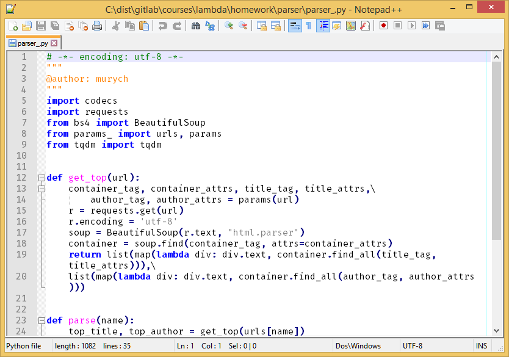
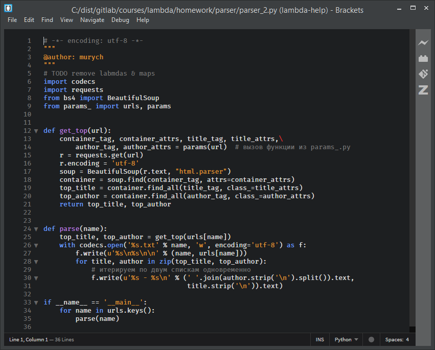
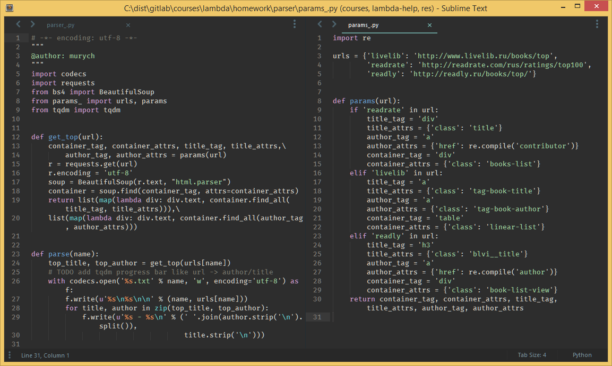
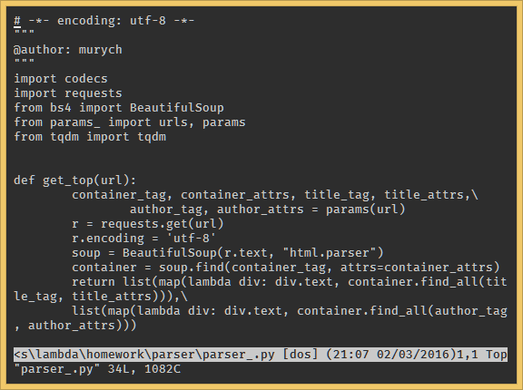
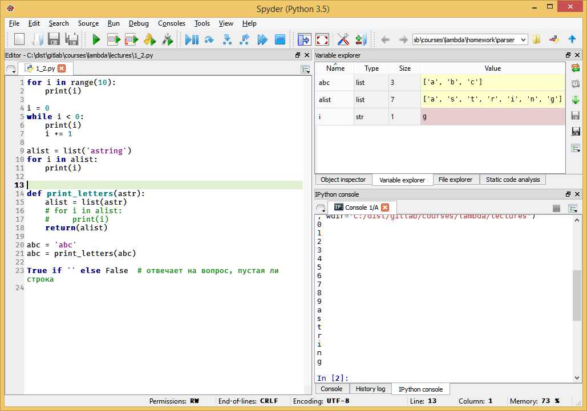
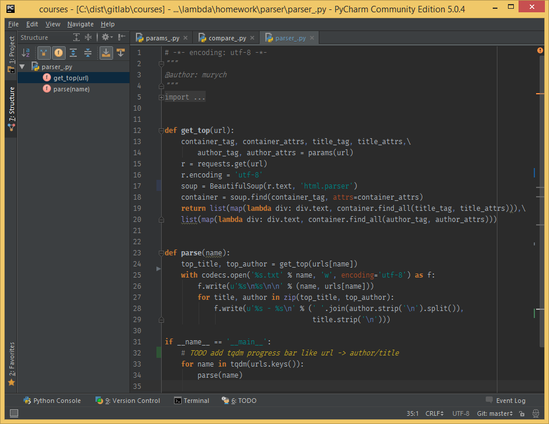

# IDE для Python

## Текстовые редакторы

### [Notepad++]()
*Описание*: Блокнот с подсветкой синтаксиса, автокомплитом, поддержкой макросов. Подойдет для мелких правок кода, а также для создания простых HTML+CSS конструкций, хотя многие используют его в качестве основного инструмена для этих целей. Распространяется бесплатно.

*Преимущества*:
- быстрый и легкий
- подсветка синаксиса ~20 языков + возможность настроить свои правила
- удобная разработка HTML и CSS
- поддержка макросов

*Недостатки*:
- не предназначен для постоянной разработки на ЯП
- немного "топорный" внешний вид

*Платформа*: Windows

*Цена*: бесплатно

### [Brackets]()
*Описание*: Текстовый редактор от компании Adobe, опять же, не предназначен для прямой работы с Python, а с HTML, CSS и JavaScript, но богатый выбор расширений сделают косметические правки кода достаточно приятным занятием (если не обращать внимания на частую задумчивость редактора, все же он сам написан на тех же HTML, CSS и JavaScript).

*Преимущества*:
- стильно, модно, молодежно
- удобная разработка HTML, CSS, Javascipt
- много дополнений

*Недостатки*:
- медленная работа
- не очень богатый функционал "из коробки"

*Платформа*: Windows, Linux, Mac

*Цена*: бесплатно

### [Sublime Text](https://sublimetext.com)
Золотая середина по простоте работы, функциональности и поддержки Python. Имеет встроенную консоль, в которой можно выполнять простые команды. С помощью дополнений сюда прикручиваются автодополнение кода, проверка качетсва кода, работа с Git и т.д.

*Преимущества*:
- написан на Python, для Python :smile:
- огромный репозиторий дополнений, позволяющий работать практически с любым ЯП
- большой набор горячих клавиш, возможность их настройки
- командное меню

*Недостатки*:
- ценник

*Платформа*: Windows, Linux, Mac

*Цена*: бесплатно/платная версия за $70.

*Полезные дополнения*:
+  [Package Control](https://packagecontrol.io/)
+  [Git](https://packagecontrol.io/packages/Git)
+  [Arduino-like IDE](https://packagecontrol.io/packages/Arduino-like%20IDE)
+  [Jedi](https://packagecontrol.io/packages/Jedi%20-%20Python%20autocompletion)
+  [Plain Tasks](https://packagecontrol.io/packages/PlainTasks)
+  [SublimeREPL](https://packagecontrol.io/packages/SublimeREPL)
+  [Auto-PEP8](https://packagecontrol.io/packages/AutoPEP8)
+  [ColorSublime](https://packagecontrol.io/packages/Colorsublime)
+  [Markdown Preview](https://packagecontrol.io/packages/Markdown%20Preview)
+  [Markdown Editing](https://packagecontrol.io/packages/MarkdownEditing)
+  [MarkdownTOC](https://packagecontrol.io/packages/MarkdownTOC)
+  [Pascal Snippets](https://packagecontrol.io/packages/Pascal%20Snippets)
+  [Python Checker](https://packagecontrol.io/packages/Python%20Checker)
+  [SideBarEnchancements](https://packagecontrol.io/packages/SideBarEnhancements)

### [Vim]()
Этой штукой можно пугать новичков. Улучшенная версия одного из старейших редакторов, появившегося аж в 1976 год. Работает преимущественно в консоли (т.к. был сделан под Unix), но имеются и GUI версии. С помощью дополнений и настроек его можно превратить во что угодно и программировать на всех доступных языках.

*Преимущества*:
- самый популярный unix-way текстовый редактор
- одна из крупнейших баз дополнений
- гибкий, настраиваемый
- удобная работа в консоли

*Недостатки*:
- **труден в освоении**
- нестандартные шорткаты

### [Emacs]()
Главный прямой конкурент Vim'а в холиварах - что же все-таки лучше? С помощью дополнений расширяется хоть до почтового клиента. Написан на диалекте Lisp'а - Esmac Lisp

*Преимущества*:
-

*Недостатки*:
-

### [IDLE](https://www.python.org/downloads/)
Стандартный редактор, устанавливающийся вместе с Python. Обладает довольно скудными возможностями, заторможенной реакцией, плохим автодополнением.

*Преимущества*:
- простой, как топор
- имеет встроенный python shell

*Недостатки*:
- неудобный
- кривой
- :с

## IDE

### [Thonny](http://thonny.cs.ut.ee/)
Thonny is a new Python IDE meant for teaching/learning programming.

*Преимущества*:
- Statement stepping without breakpoints
- Live variables during debugging
- Stepping through evaluation of the expressions (expressions get replaced by their values)
- Separate windows for executing function calls (helps explaining local variables and call stack; good understanding of how function calls work is especially important for understanding recursion)
- Variables can be explained either by using simplified model (name -> value) or by using more realistic model (name -> address/id -> value)

### [Spyder](https://github.com/spyder-ide)
Отличная IDE для ведения проектов малой и средней сложности. Благодаря встроенному анализатору переменных удобна для задач машинного обучения, дата майнинга, а также обучения основам программирования. Полный автокомплит, анализ кода, подсветка ошибок, pep8.

*Преимущества*:
- наглядная визуализация объектов, создаваемых скриптом
- поддержка iPython консоли
- дебаггер
- анализ кода, автокомплит
- поиск документации по языку и библиотекам внутри IDE :exclamation:
- open source же

*Недостатки*:
- на крупных проектах может начать тупить

*Платформа*: Windows, Linux, Mac

*Цена*: бесплатно

### [Jetbrains PyCharm](http://www.jetbrains.com/pycharm/)
Считается самой серьезной и проффесиональной IDE на рынке. Заточена специально под Python -> количество преимуществ неперечисляемо. Тут и анализатор кода, и "умное" автодополнение, и разнообразные консоли, дебаггер, настройка интерпретаторов, установка библиотек, etc. Использовать по мелочи невыгодно, ибо очень тяжелая IDE, но на сложных проектах себя оправдывает.

*Преимущества*:
- дебаггер, анализатор кода
- параметры запуска
- настройка интерпретаторов, установка библиотек
- встроенная работа с Git
- доступны консоли операционной системы и Python

*Недостатки*:
- написан на Java, отсюда не очень шустрая работа
- экспериментально установлено, что математические выражения иногда считаются через магию и не совпадают с результатами у других IDE ಥ_ಥ

*Платформа*: Windows, Linux, Mac

*Цена*: бесплатно версия Community и Educational/Professional версия за $199/Professional версия для студентов бесплатно

### [Eric IDE](http://eric-ide.python-projects.org/)

### [Rodeo](http://blog.yhat.com/posts/introducing-rodeo.html)

### Jupyter Notebook

### [Canopy](https://www.enthought.com/products/canopy/)
рекомендуют в курсе MIT 6.00.1.x (Introduction to Computer Science and Programming Using Python);

*Преимущества*:
- наглядная визуализация объектов, создаваемых скриптом
- поддержка iPython консоли
- дебаггер
- анализ кода, автокомплит

*Недостатки*:

*Платформа*: Windows, Linux, Mac

*Цена*: бесплатно

## Мобильные платформы

### Andoid

#### QPython

### iOS

#### Pythonista