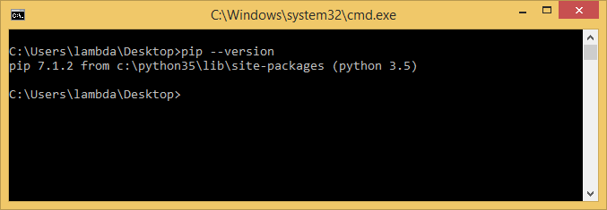
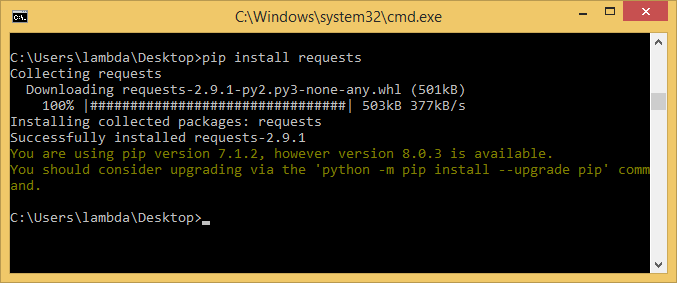

# Установка и настройка `pip`

В теории, в Python 3.x `pip` устанавливается автоматически вместе с самим пайтоном

Однако, если этого не произошло, то это легко исправить:
- скачать [этот](https://bootstrap.pypa.io/get-pip.py) установочный файл
- зайти в папку, куда скачался файл `get-pip.py`
- открыть в ней командную строку
- ввести `python get-pip.py`

**Готово!**

Теперь установим пару библиотек. Для первого проекта, веб-краулера (паука), нам понадобятся библиотеки `requests` и `BeautyfulSoup4`. Для их установки с помощью `pip`:
- открыть командную строку
- ввести в ней `pip install requests`

- ввести в ней `pip install BeautyfullSoup4`

**Успех!** Перейдем к настройке [`Sublime Text`](sublime.md)