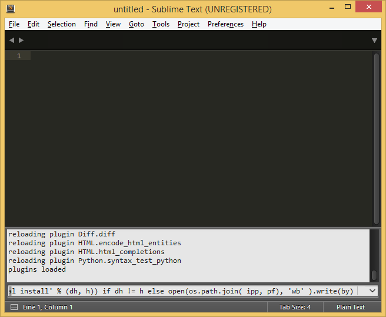
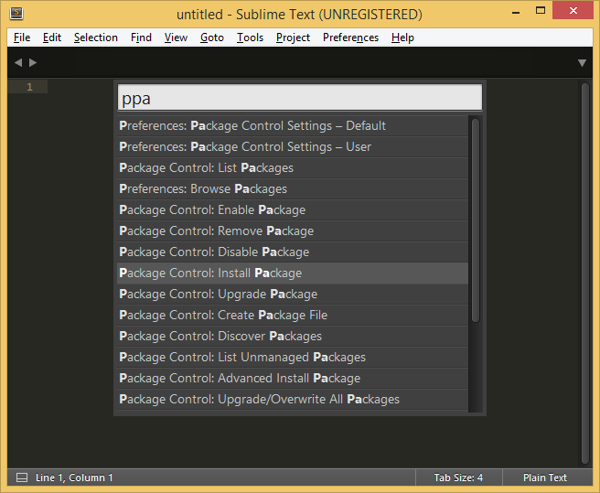

# Sublime Text 3

- заходим на официальный сайт, скачиваем установщик

- устанавливаем программу


**Всё!**
Но для немного более комфортной работы с пайтоном можно выполнить еще несколько ходов. Установим *Package Control*, дополнение, упрощающее установку разнообразных плагинов/дополнений/тем к редактору.

- нажимаем в саблайме `Ctrl + ~`, попадаем во встроенную консоль, в нее вставляем эту волшебную надпись
```python
import urllib.request,os,hashlib; h = '2915d1851351e5ee549c20394736b442' + '8bc59f460fa1548d1514676163dafc88'; pf = 'Package Control.sublime-package'; ipp = sublime.installed_packages_path(); urllib.request.install_opener( urllib.request.build_opener( urllib.request.ProxyHandler()) ); by = urllib.request.urlopen( 'http://packagecontrol.io/' + pf.replace(' ', '%20')).read(); dh = hashlib.sha256(by).hexdigest(); print('Error validating download (got %s instead of %s), please try manual install' % (dh, h)) if dh != h else open(os.path.join( ipp, pf), 'wb' ).write(by)
```



и перезагружаем редактор

- нажимаем `Ctrl + Shift + P`, попадаем в коммандное меню. вводим в нем `ppa`, выбираем пункт меню *Package Control: Install Package*



- вводим имя нужного нам дополнения, для начала установим модуль автодополнения синтаксиса `jedi`


**Успех!**

Дополнительно, можно установить следующие дополнения:

+  `Git` - для работы с системами контроля версий
+  `SublimeREPL` - открывает пайтновский интерпетатор, в котором можно пошагово выполнять код
+  `Auto-PEP8` - форматирует код, согласно правилам оформления **pep8**
+  `BracketsHighlighter` - подсвечивает скобочки :+1:

С полным списком плагинов можно ознакомиться на [сайте](https://packagecontrol.io/browse).
