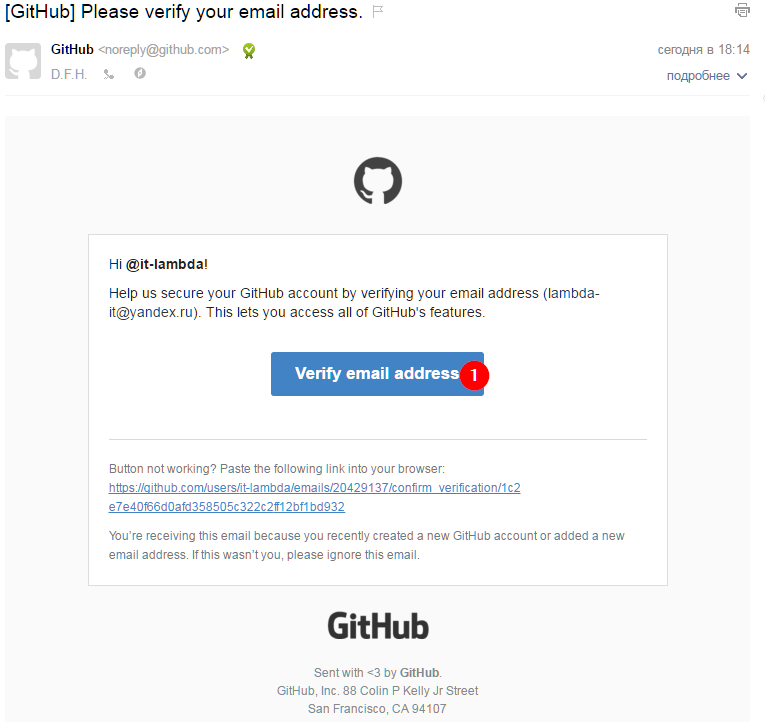
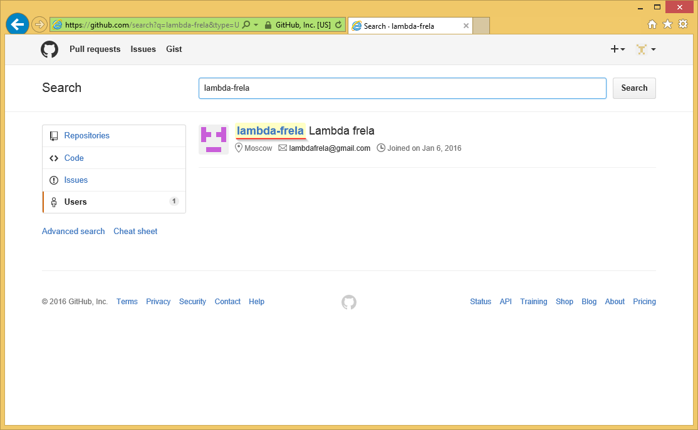
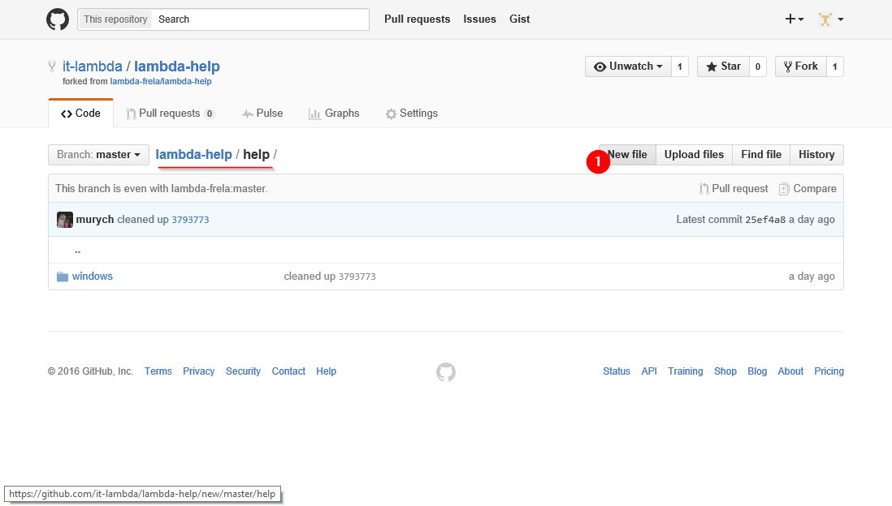
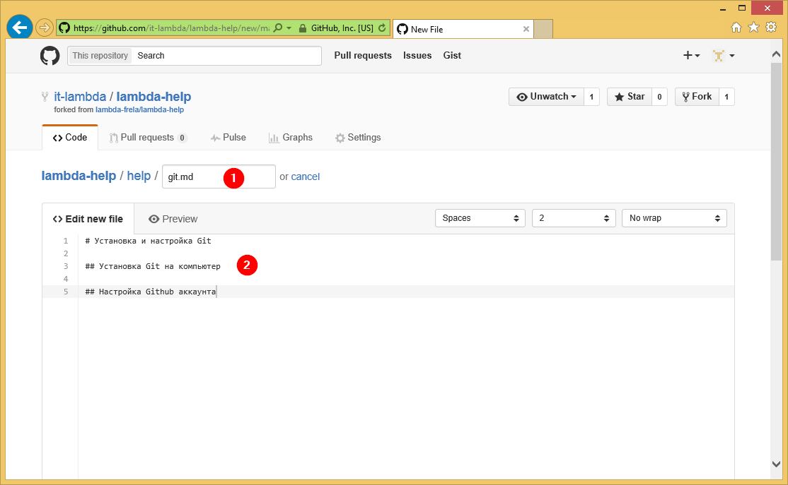
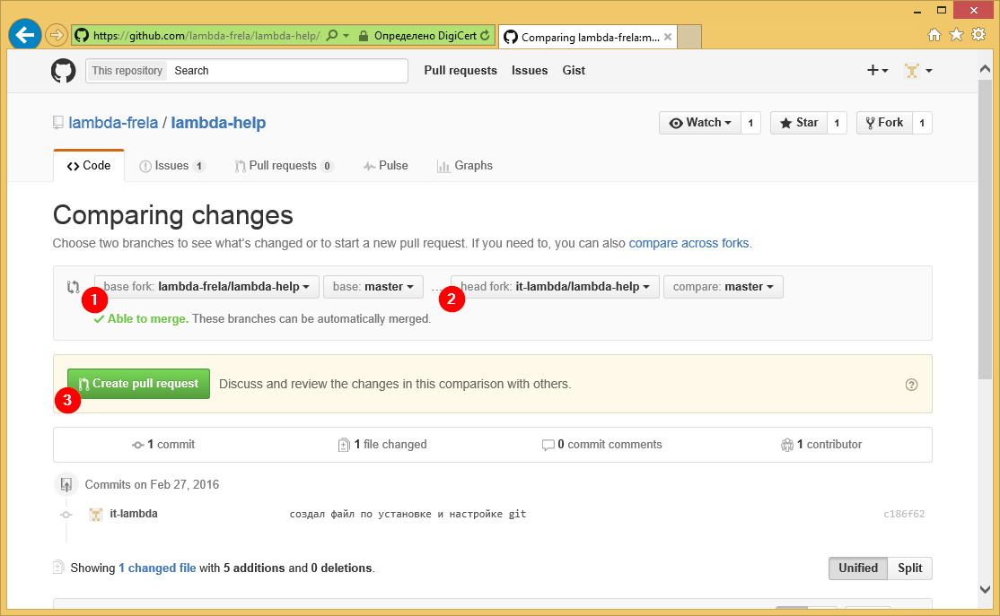

# Установка и настройка Git

Оглавление:

- [Регистрация на сайте Github](#github)
- [Установка Git for Windows](#git)

## Github

- направляется на сайт [Github](https://github.com/) и заполняем данные для регистрации

- заходим в свой почтовый ящик, открываем письмо от `noreply@github.com` и подтверждаем свой аккаунт

- заходим на Github и ищем пользователя `lambda-frela`

- выбираем **репозиторий** `lambda-help`

- создадим **форк** репозитория, т.е. вашу личную его копию, над которой вы имеете полную власть

- создадим файл `help/git.md`

- напишем в нем что-нибудь полезное (например, инструкцию, по использованию `git`) и **закоммитим** наши измненеия, кратко указав, что мы изменили. более развернутое пояснение причин и мотивов для правок можно указать в поле *Add an optional description*

- теперь предложим авторам репозитория взглянуть на внесенные измненения, а, может быть даже и принять их. для этого создадим **Pull Request**

- указываем **base fork** (форк, **в который** будем заливать изменения) и **head fork** (форк, **из которого** будут браться измнения), нажимаем *Create Pull Request*

- готово, вы великолепны!

## Git
- скачать установщик git for windows
- установить
- скачать репозиторий
- ?????
- PROFIT!

