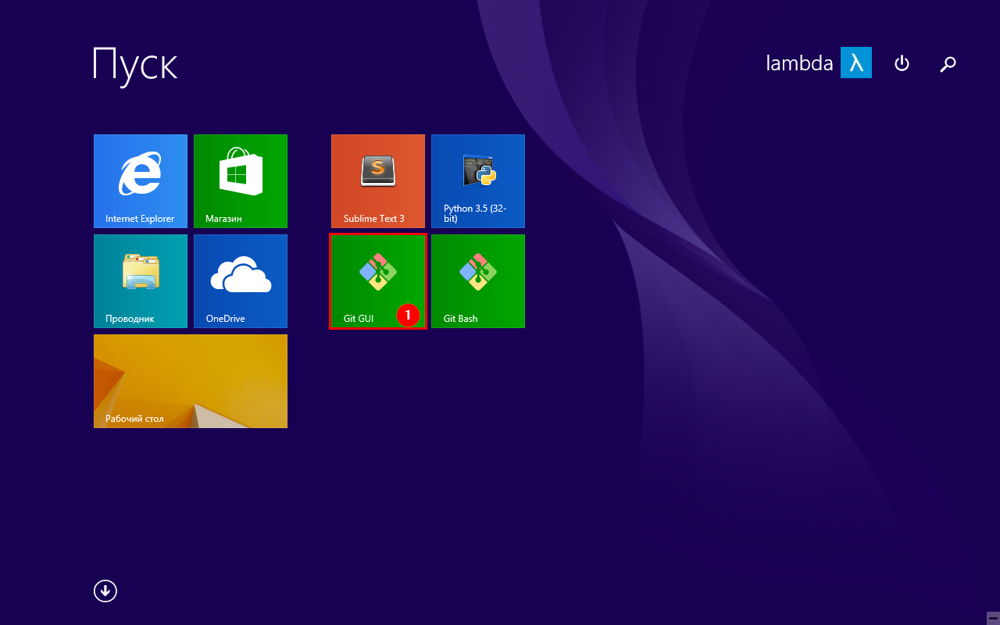
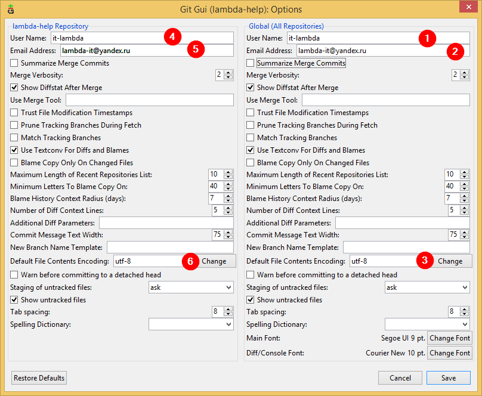
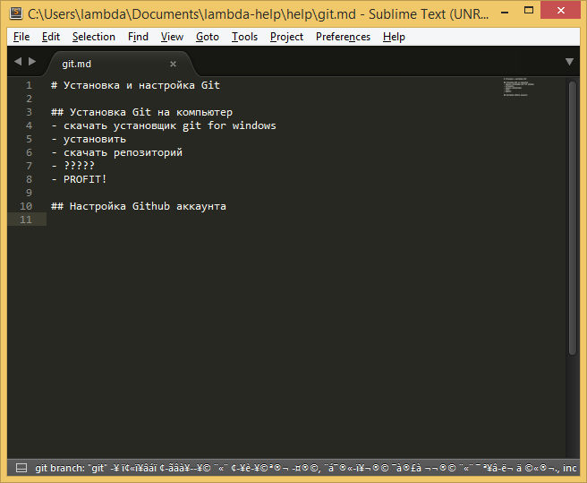
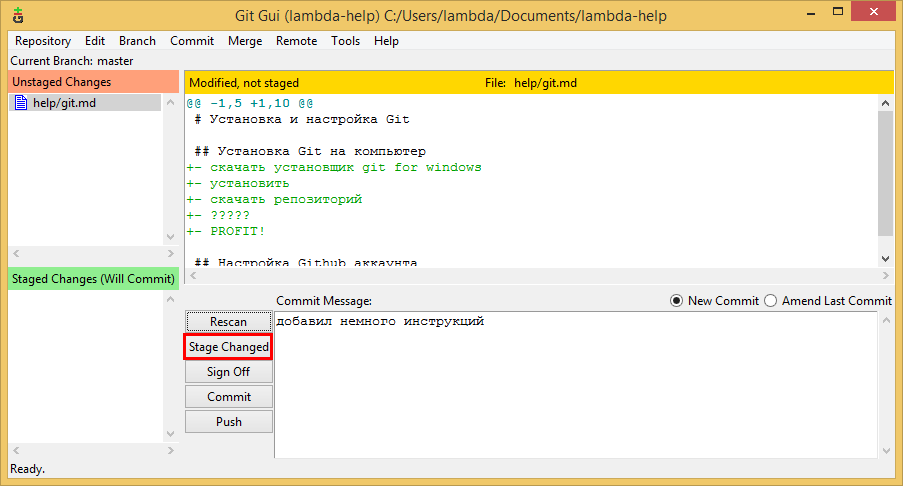
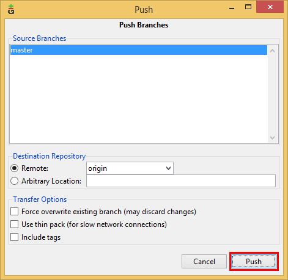
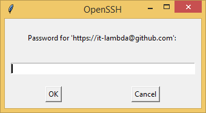
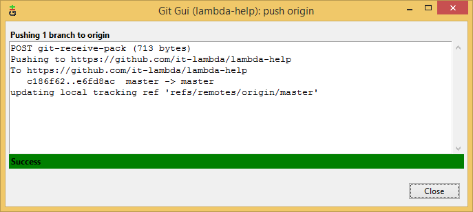

# Установка и настройка Git

Оглавление:

- [Регистрация на сайте Github](#github)
- [Установка Git for Windows](#git)

## Github

- направляется на сайт [Github](https://github.com/) и заполняем данные для регистрации

- заходим в свой почтовый ящик, открываем письмо от `noreply@github.com` и подтверждаем свой аккаунт

А теперь - немного практики! Найдем репозиторий нашего сообщества, сохраним себе, и даже внесем небольшой вклад в общее дело!

- заходим на [Github](https://github.com/) и ищем пользователя `lambda-frela`

- выбираем **репозиторий** `lambda-help`

- создадим **форк** репозитория, т.е. вашу личную его копию, над которой вы имеете полную власть

- создадим файл `help/git.md`

- напишем в нем что-нибудь полезное (например, инструкцию, по использованию `git`) и **закоммитим** наши измненеия, кратко указав, что мы изменили. более развернутое пояснение причин и мотивов для правок можно указать в поле *Add an optional description*

- теперь предложим авторам репозитория взглянуть на внесенные измненения, а, может быть даже и принять их. для этого создадим **Pull Request**

- указываем **base fork** (форк, **в который** будем заливать изменения) и **head fork** (форк, **из которого** будут браться измнения), нажимаем *Create Pull Request*

- готово, вы великолепны!

## Git
Теперь научимся сохранять репозитории на свой компьютер, редактировать файлы и отправлять изменения на сервер!

- заходим на сайт [Git](http://www.git-scm.com/downloads) и скачиваем там версию для Windows

- устанавливаем файл `Git-2.7.2-...exe`, все опции оставляем по умолчанию (нам и так сойдет :ok_hand:)

- в меню *Пуск* находим программу **Git GUI**, запускаем

- выбираем пункт *Clone Existing Repository*

- в поле *Source Location* указываем url нашего форкнутого (в верхнем разделе) репозитория, в *Target Directory* выбираем место, куда сохраним, нажимаем `Clone`

- в появившемся окне открываем меню `Edit` -> `Options`, и заполняем
    + *User Name* - ваш юзернейм
    + *Email Address* - ваша почта
    + **важно** в поле *Default File Contents Encoding* нажать кнопку `Change` и выбрать `utf-8`, чтобы не ловить кракозябр (ну и XXI век, come on)

- весело открываем проводник и направляемся туда, куда мы скачали репозиторий

- откроем файл `help/git.md`, который мы создали ранее, с помощью Sublime Text

- пишем всякие полезные вещи/код/формулу лекарства от рака, сохраняем, закрываем, переключаемся обратно в Git GUI

- добавляем в наш коммит измененный файл, пишем ~~гневное~~ сообщение о проделанной работе, коммитим и пушим (**Push**). последнее действие отправит наш коммит с изменениями на сервер

- в появившемся окне еще раз нажимаем Push, вводим логин и пароль в появившихся окнах

- готово, теперь файл `git.md` на страничке вашего репозитория содержит все изменения

