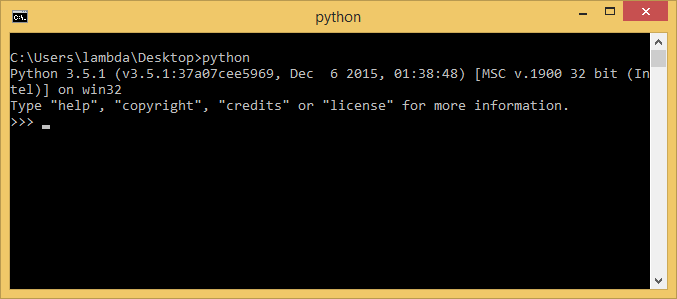

# Установка Python

- Скачиваем установщик с официального сайта

- Запускаем установщик с правами администратора

- При установке выбираем опции, как на изображениях (не обязательно, но так гарантируется правильная работа :smile:)

- Проверяем установку
	- Открываем командную строку, водим `python`

**Готово!** Можно перехоить к настройке [`pip`](pip-libs.md)