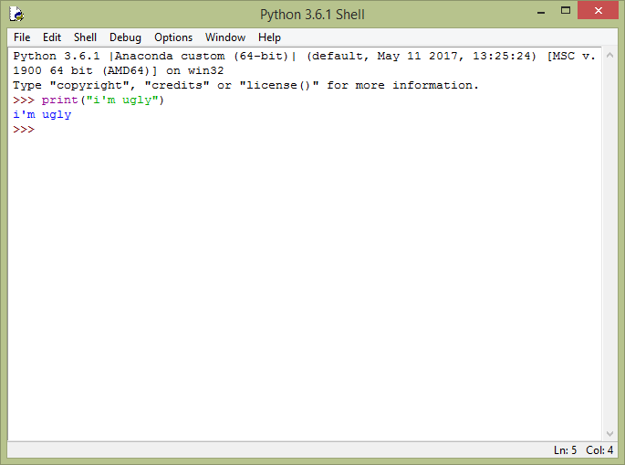
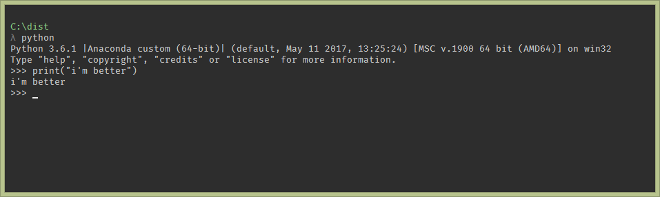

# Python - немного истории

## Гвидо Ван Россум


> Over six years ago, in December 1989, I was looking for a "hobby" programming project that would keep me occupied during the week around Christmas. My office ... would be closed, but I had a home computer, and not much else on my hands. I decided to write an interpreter for the new scripting language I had been thinking about lately...


## Идейный вдохновитель - ABC

```ABC
HOW TO RETURN words document:
   PUT {} IN collection
   FOR line IN document:
      FOR word IN split line:
         IF word not.in collection:
            INSERT word IN collection
   RETURN collection
```

## Цель

- создать простой, понятный, удобный и полезный язык
- пример функции:
```python
def magic(dir):
    acc = []
    for root, dirs, files in os.walk(dir):
        acc.extend(os.path.join(root, file) for file in files)
    return acc
```
- что делает эта функция?


```python
import os
def magic(dir):
    acc = []
    for root, dirs, files in os.walk(dir):
        acc.extend(os.path.join(root, file) for file in files)
    return acc
magic('.')
```


    ['.\\custom.css',
     '.\\README.ipynb',
     '.\\README.md',
     '.\\README.slides.html',
     '.\\.ipynb_checkpoints\\README-checkpoint.ipynb',
     '.\\pics\\1.png',
     '.\\pics\\presentation.png']


## 2.x VS 3.x

- Python 2.x находится в режиме поддержки, обновлений выходить не будет
    - достоинства
        - штабильно
        - громадное количество библиотек
        - `print "hello world"`
    - недостатки
        - содержит много костылей, исправить которые, не нарушив работу системы нельзя
        - строки и символы изначально кодируются в байткод
        - **ЛЕГАСИ**


- Python 3.x - в режиме активной разработки
    - достоинства
        - все строки ялвяются Unicode объектами
        - упрощены некоторые конструкции методов
        - бОльшая часть элементов языка стала объектами (например, `map` по версии 2.x - `list`, по версии 3.x - `map object`)
    - недостатки
        - не все библиотеки портированы с 2.x

В наших проектах будем использовать Python 3.x (3.4 - 3.6 котируются), для упрощения процедуры поддержки кода

## _Let the Holywar begin!_


# Запуск программы

## Интерактивный режим

### IDLE



### Консоль

1. открыть консоль
2. `python` (для пользователей Ubuntu - `python3`)



## Из скрипта `.py`

1. открыть консоль
2. `cd <пусть\к\папке\с\файлом>`
3. `python my_program.py`
    - для пользователей Ubuntu/Debian: `python3 my_program.py`
    


# Ввод/вывод


```python
my_variable = input() # ввод данных с клавиатуры (или через стандартный ввод stdin)

print(my_variable) # вывод данных в стандартный вывод stdout
```

    42
    42
    

Присвоение значений переменным может производиться в одну строчку через запятую (как в учебниках по матану, с последующим "соответственно")


```python
coords, speed, velocity = input(), input(), 'no'
print(coords, speed, velocity)
```

    34
    45
    34 45 no
    

Хитрые способы присваивания позволяют творить и вот такие финты


# Некоторые стандартные типы данных

- числовые
    - целые числа `int` - 5
    - вещественные числа (с плавающей точкой) `float` - 5.0
    - логические `bool` - True/False
- строковые
    - строки `str`
    
### чтобы узнать тип переменной (объекта) - `type(x)`

## Преобразование типов

- `int(x)` - преобразование к целому числу


```python
int(2.3)
```


    2


- `float(x)` - преобразование к числу с плавающей точкой


```python
float(5)    
```


    5.0


### _task 1_
вычислить выражение
```python
9**19 - int(float(9**19))
```

# Мотан

- базовые операторы


```python
print(42 + 24) # сложение
print(45 - 100) # вычитание
print(3 * 98) # умножение
```

    66
    -55
    294
    

- оператор деления


```python
print(7 / 3) # дробный результат деления
print(7 // 3) # целочисленный результат деления (аналог div в pascal)
print(7 % 3) # остаток от деления (аналог mod в pascal)
```

    2.3333333333333335
    2
    1
    

- возведение в степень


```python
print(2 ** 8)
```

    256
    

### _task 2_

Допустим, нам нужно проанализировать математическую модель, описывающую движение тела, подброшенного вертикально вверх:
$$y(t) = v_0 t - \frac{gt^2}{2}$$

написать алгоритм, принимающий значение $t$ при заданных $g = 9.81$ и $v_0 = 5$, чтобы найти координату $y$


```python
# решение
v0 = 5
g = 9.81
t = float(input())

y = v0 * t - (1/2) * g * t**2
print(y)
```

    1
    0.09499999999999975
    

# Строки

Строки могут быть:

- однострочными:


```python
not_very_long_string = 'wow, such little code here'

print(not_very_long_string)
```

    wow, such little code here
    

- однострочными с переносами при помощи символа `\n`:


```python
not_very_long_string = 'wow, \nsuch little \ncode here'

print(not_very_long_string)
```

    wow, 
    such little 
    code here
    

- или просто многострочными:


```python
very_long_string = """wow, 
such little 
code here"""

print(very_long_string)
```

    wow, 
    such little 
    code here
    

## Форматирование текста и чисел

Для версии 3.x существует 6 разных способов вывода строки, содержащую значения переменных. Рассмотрим основные:


```python
"spam = {0}, eggs = {1}".format("blah", 2)
```


    'spam = blah, eggs = 2'


```python
# python >3.6 only
man_age = 42
woman_age = 31

print(f'man = {man_age}, woman = {woman_age}')
```

    man = 42, woman = 31
    


```python
"spam = %s, eggs = %d" % ("blah", 2)
```


    'spam = blah, eggs = 2'


| флаг 	| описание                                                	|
|------	|---------------------------------------------------------	|
|  %s  	| строка                                                  	|
|  %d  	| целое число                                             	|
|  %f  	| десятичное представление с шестью знаками после запятой 	|
|  %e  	| "научное" представление                                 	|
|  %g  	| компактное представление десятичного числа              	|
|  %%  	| вывод знака процента                                    	|

## _"математические"_ операции со строками

- конкатенация:


```python
'lorem' + 'ipsum'
```


    'loremipsum'


- умножение:


```python
'lorem ipsum ' * 3
```


    'lorem ipsum lorem ipsum lorem ipsum '


- сравнение по значению (аналог `.equals()` в Java)


```python
'lorem ipsum' == 'lorem ipsum'
```


    True


```python
'lorem ipsum' == 'hello world'
```


    False


# Логика

## Операторы сравнения


```python
C = 40

print(C == 40)  # C равно 40
print(C != 40)  # C не равно 40
print(C >= 40)  # C больше или равно 40
print(C >  40)  # C больше 40
print(C <  40)  # C меньше 40
```

    True
    False
    True
    False
    False
    

## Логические выражения


```python
x = 0; y = 1.2
x >= 0 and y < 1
```


    False


```python
x >= 0 or y < 1
```


    True


```python
x > 0 or not y > 1
```


    False


```python
not (x > 0 or y > 0)
```


    False


# Условные операторы

## if - else


```python
x = 14
if x % 2 == 0:
    print('Четное')
else:
    print('Нечетное')
```

    Четное
    

## много условий

```python
if statement_1:
    expression_1
elif statement_2:
    expression_2
else:
    expression_3
```

## тернарный оператор


```python
"четное" if x % 2 == 0 else "нечетное"
```


    'четное'


## _task 3_

Требуется определить, является ли данный год високосным.

Напомним, что високосными годами считаются те годы, порядковый номер которых либо кратен 4, но при этом не кратен 100, либо кратен 400 (например, 2000-й год являлся високосным, а 2100-й будет невисокосным годом). 

Программа должна корректно работать на числах $1900 \leqslant n \leqslant 3000$.

Выведите "__Високосный__" в случае, если считанный год является високосным и "__Обычный__" в обратном случае (не забывайте проверять регистр выводимых программой символов).


```python
year = int(input())

if ((year % 4 == 0) and (year % 100 != 0)) or (year % 400 == 0):
    print('Високосный')
else:
    print('Обычный')
```

    2100
    Обычный
    

# Функции

Простейший пример:


```python
def foo():
    return 42

foo()
```


    42


если не используется `return`, функция по умолчанию возвращает `None`:


```python
def foo():
    42
print(foo())
```

    None
    

## Передача аргументов


```python
def min(x, y):
    return x if x < y else y
```


```python
min(-5, 12)
```


    -5


```python
min(x=12, y=-5)
```


    -5


### _task 4_

Напишите функцию f(x), которая возвращает значение следующей функции, определённой на всей числовой прямой:

$$f(x)= \begin{cases}   1 - (x + 2)^2,\quad &\text{при  } x\le -2\\  -\frac x2 ,\quad &\text{при } -2 \lt  x \le 2\\   (x-2)^2 + 1,\quad &\text{при }  2 \lt  x \end{cases}$$

| Ввод 	| Вывод 	|
|------	|-------	|
| 4.5  	| 7.25  	|
| -4.5 	| -5.25 	|
| 1    	| -0.5  	|


```python
def f(x):
    if x <= -2:
        return(1-(x+2)**2)
    if x > -2 and x <= 2:
        return(-(x/2))
    if x > 2:
        return(((x-2)**2)+1)

f(1)
```


    -0.5


# Наборы данных

## Списки (Lists)

Изменяемые наборы данных

```python
list_ = [ ]
list_ = list()
```


```python
x = ['zebra', 49, -879, 'aardvark', 200]
```


```python
len(x)
```


    5


```python
x[0]
```


    'zebra'


```python
x[-1]
```


    200


## Числовая последовательность

```python
range(START, STOP, STEP)
```


```python
print(list(range(10)))

print(list(range(1, 10)))

print(list(range(1, 10, 2)))
```

    [0, 1, 2, 3, 4, 5, 6, 7, 8, 9]
    [1, 2, 3, 4, 5, 6, 7, 8, 9]
    [1, 3, 5, 7, 9]
    

Для того, чтобы развернуть последовательность в обратную сторону, используется функция `reversed()`


```python
list(reversed(range(10)))
```


    [9, 8, 7, 6, 5, 4, 3, 2, 1, 0]


## Слайсы / срезы / два ствола
Общий вид
```python
list[START:STOP:STEP]
```


```python
x[:]
```


    ['zebra', 49, -879, 'aardvark', 200]


```python
x[:-1]
```


    ['zebra', 49, -879, 'aardvark']


```python
x[1:-1]
```


    [49, -879, 'aardvark']


```python
x[::2]
```


    ['zebra', -879, 200]


### Операции со списками
```python
lst.append(item) # добавить элемент в конец
lst.extend(seq)  # добавить последовательность в конец
lst.insert(idx,val) # вставить значение по индексу
lst.remove(val)     # удалить первое вхождение val
lst.pop(idx)        # удалить значение по индексу и вернуть его
lst.sort() lst.reverse() # сортировать/обратить список по месту
```


```python
x.append('datass')
x
```


    ['zebra', 49, -879, 'aardvark', 200, 'datass']


```python
x.insert(1, 'face')
x
```


    ['zebra', 'face', 49, -879, 'aardvark', 200, 'datass']


```python
last_val = x.pop(0)
print(x, last_val)
```

    ['face', 49, -879, 'aardvark', 200, 'datass'] zebra
    


```python
a = [123, 4, 0, 44, 14, 2, 8]
a.sort()
a
```


    [0, 2, 4, 8, 14, 44, 123]


Проверка на принадлежность списку


```python
'face' in x
```


    True


```python
'MADI' in x
```


    False


### task

Сколько элементов будет содержать список _students_ после следующих операций?

```python
students = ['Ivan', 'Masha', 'Sasha']
students += ['Olga']
students += 'Olga'
```

# 8


## Кортежи (Tuples)

Иммутабельны, т.е. неизменяемы.

```python
tuple_ = ()
tuple_ = tuple()
```


```python
tuple_ = ('Denmark', 'Finland', 'Norway', 'Sweden')
```


```python
print("Длина кортежа - {0}".format(len(tuple_)))
```

    Длина кортежа - 4
    


```python
print(tuple_[0])
```

    Denmark
    


```python
print(tuple_[-1])
```

    Sweden
    

Попытка изменить кортеж приведет к закономерному провалу, т.к. кортеж __неизменяем__


```python
tuple_.append('something')
```


    ---------------------------------------------------------------------------

    AttributeError                            Traceback (most recent call last)

    <ipython-input-22-f5f46c8f6eef> in <module>()
    ----> 1 tuple_.append('something')
    

    AttributeError: 'tuple' object has no attribute 'append'


## Словари (Dictionaries)

```python
my_dict = {}
my_dict = dict()

my_dict = {'key':'value'}
```


```python
MAI = {1:'авиастроение', 'инжэкин':5, 9:'прикладная механика'}
```


```python
MAI.keys()
```


    dict_keys([1, 'инжэкин', 9])


```python
MAI.values()
```


    dict_values(['авиастроение', 5, 'прикладная механика'])


```python
MAI[1], MAI['инжэкин']
```


    ('авиастроение', 5)


```python
MAI_2 = {8: 'прикладная математика',
         4: 'радиоэлектроника летательных аппаратов'}

MAI.update(MAI_2)
MAI
```


    {8: 'прикладная математика',
     1: 'авиастроение',
     4: 'радиоэлектроника летательных аппаратов',
     'инжэкин': 5,
     9: 'прикладная механика'}


# ДЗ

0. Выполнить таски из лекции (кто не сделал)
1. Решить 11 задачек из модуля [String-1](http://codingbat.com/python/String-1) на **CodingBat**
2. Отчитаться о выполнении в [#random'e](https://lambdafrela.slack.com/messages/random/)

# Почитать

- [Правила оформления Python кода на русском](https://pythonworld.ru/osnovy/pep-8-rukovodstvo-po-napisaniyu-koda-na-python.html), с которыми __необходимо__ ознакомитья и следовать 95% написанного.

# Next episode...

- списки, кортежи, словари
- циклы
- файлы
- модули
- немного функциональщины
